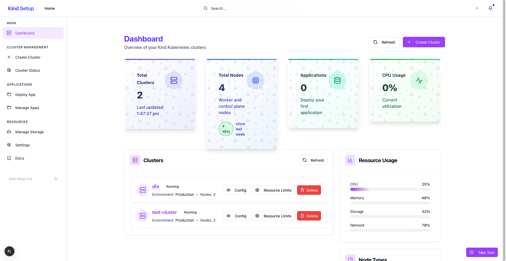
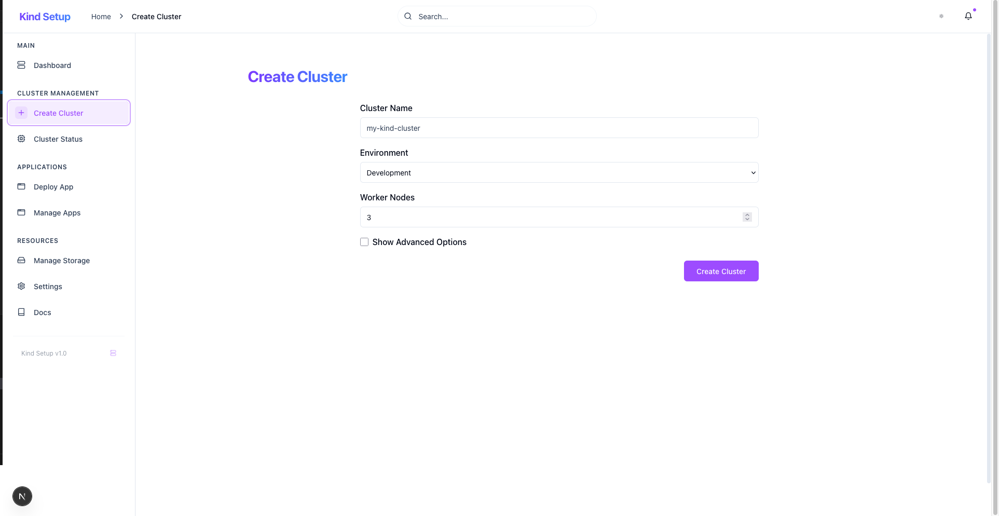
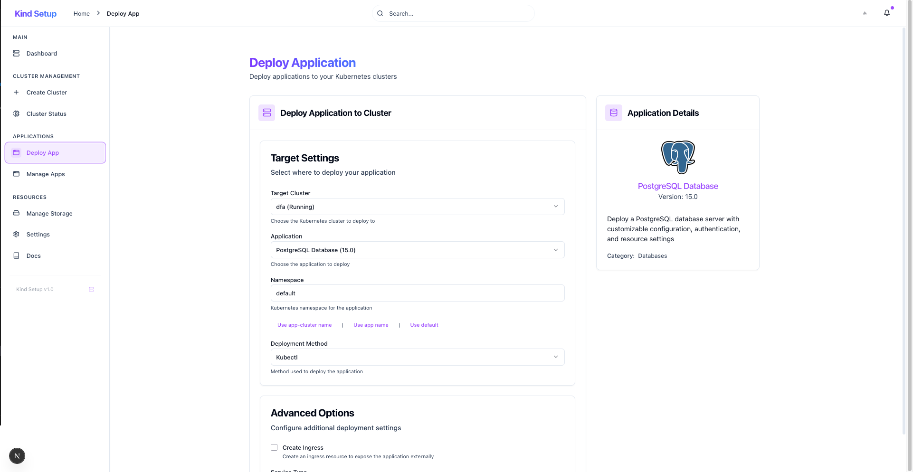
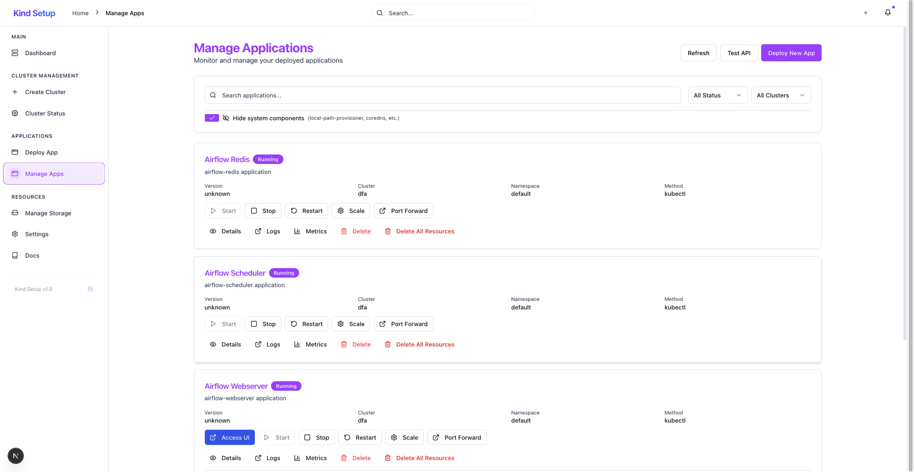
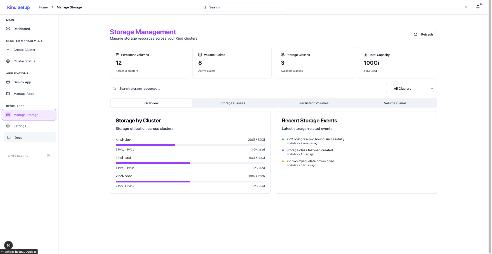
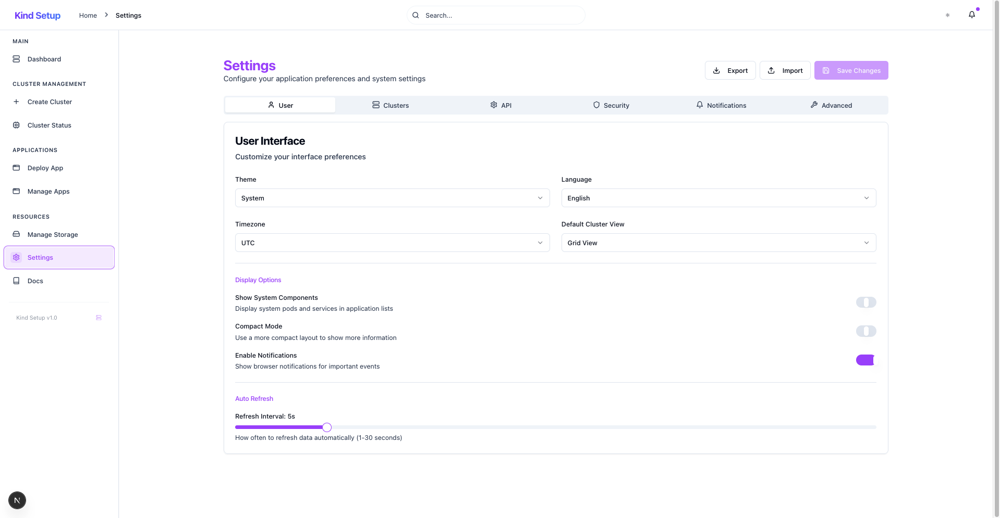

# Kind Cluster Setup - User Interface Guide

This guide provides a comprehensive overview of the Kind Cluster Setup web interface, showcasing all major features and functionality.

## 🎯 **Overview**

The Kind Cluster Setup application provides a modern, intuitive web interface for managing Kubernetes clusters using Kind (Kubernetes in Docker). The interface is built with React/Next.js and features a clean, responsive design with comprehensive functionality for cluster and application management.

## 🧭 **Navigation Structure**

The application uses a sidebar navigation with organized sections:

### **Main**
- **Dashboard** - Overview of all clusters and system status

### **Cluster Management**
- **Create Cluster** - Set up new Kind clusters
- **Cluster Status** - Detailed cluster monitoring and resource utilization

### **Applications**
- **Deploy App** - Deploy applications using templates
- **Manage Apps** - Monitor and manage deployed applications

### **Resources**
- **Manage Storage** - Storage resource management across clusters
- **Settings** - Application configuration and preferences
- **Docs** - Documentation and help

## 📱 **User Interface Pages**

### 1. Dashboard (`/`)

**Key Features:**
- **System Overview Cards**: Total clusters, nodes, applications, and CPU usage
- **Cluster List**: Real-time status of all Kind clusters
- **Resource Usage Charts**: Visual representation of system utilization
- **Recent Activity Feed**: Timeline of recent cluster and application events
- **Quick Actions**: Direct access to create cluster and refresh functions

**User Workflow:**
1. View system overview at a glance
2. Monitor cluster health and status
3. Access quick actions for common tasks
4. Review recent activity and system changes

### 2. Create Cluster (`/create-cluster`)

**Key Features:**
- **Simple Form Interface**: Easy cluster configuration
- **Environment Selection**: Development vs Production presets
- **Worker Node Configuration**: Adjustable node count
- **Advanced Options**: Expandable section for detailed configuration
- **Real-time Validation**: Form validation and error handling

**User Workflow:**
1. Enter cluster name and select environment
2. Configure worker nodes and advanced options
3. Submit cluster creation request
4. Monitor creation progress with real-time updates

### 3. Deploy Application (`/deploy-app`)

**Key Features:**
- **Template Selection**: Choose from pre-configured application templates
- **Dynamic Form Generation**: Forms adapt based on selected template
- **Parameter Configuration**: Customize deployment parameters
- **Validation and Preview**: Real-time validation and deployment preview
- **Multi-cluster Support**: Deploy to any available cluster

**User Workflow:**
1. Select application template (Airflow, MySQL, etc.)
2. Configure deployment parameters and values
3. Choose target cluster and namespace
4. Review configuration and deploy

### 4. Manage Applications (`/manage-apps`)

**Key Features:**
- **Application Grid View**: Visual overview of deployed applications
- **Advanced Filtering**: Filter by status, cluster, and search functionality
- **System Component Toggle**: Hide/show system components
- **Bulk Operations**: Multi-select for batch operations
- **Real-time Status**: Live application health monitoring

**User Workflow:**
1. View all deployed applications across clusters
2. Filter and search for specific applications
3. Monitor application health and status
4. Perform management operations (start, stop, scale, delete)

### 5. Storage Management (`/manage-storage`) - **NEW FEATURE**

**Key Features:**
- **Storage Overview Dashboard**: Comprehensive storage metrics
- **Multi-tab Interface**: Organized views for different storage resources
- **Cluster-wise Storage Utilization**: Visual progress bars showing usage
- **Recent Storage Events**: Timeline of storage-related activities
- **Resource Filtering**: Search and filter storage resources

**Tabs Available:**
- **Overview**: Storage summary and utilization across clusters
- **Storage Classes**: Available storage class configurations
- **Persistent Volumes**: PV management and monitoring
- **Volume Claims**: PVC status and binding information

**User Workflow:**
1. Monitor storage utilization across all clusters
2. View detailed storage resource information
3. Manage persistent volumes and claims
4. Track storage events and changes

### 6. Settings (`/settings`) - **NEW FEATURE**

**Key Features:**
- **Tabbed Configuration Interface**: Organized settings categories
- **User Preferences**: Theme, language, timezone, and display options
- **Cluster Defaults**: Default configurations for new clusters
- **Security Settings**: RBAC, audit logging, and access control
- **Notification Management**: Email, webhook, and Slack integration
- **Configuration Backup**: Export/import functionality

**Settings Categories:**
- **User**: Interface preferences and display options
- **Clusters**: Default cluster configurations
- **API**: Connection settings and timeouts
- **Security**: Access control and audit settings
- **Notifications**: Alert and notification preferences
- **Advanced**: System-level configurations and tool paths

**User Workflow:**
1. Customize interface preferences and themes
2. Configure default cluster settings
3. Set up security and notification preferences
4. Export/import configuration for backup

## 🎨 **Design System**

### **Color Scheme**
- **Primary**: Blue accent colors for actions and highlights
- **Secondary**: Gray tones for backgrounds and borders
- **Status Colors**: Green (success), Red (error), Yellow (warning), Blue (info)
- **Dark Mode Support**: Automatic theme switching with system preferences

### **Typography**
- **Headings**: Clear hierarchy with consistent sizing
- **Body Text**: Readable font sizes with proper contrast
- **Code/Monospace**: Used for technical information and IDs

### **Components**
- **Cards**: Consistent card-based layout for content sections
- **Buttons**: Primary, secondary, and destructive action styles
- **Forms**: Comprehensive form controls with validation
- **Tables**: Responsive data tables with sorting and filtering
- **Modals**: Overlay dialogs for detailed information and actions

## 🔄 **Interactive Features**

### **Real-time Updates**
- **Auto-refresh**: Configurable refresh intervals (1-30 seconds)
- **Live Status**: Real-time cluster and application status updates
- **Progress Tracking**: Live progress bars for long-running operations

### **Responsive Design**
- **Mobile-friendly**: Optimized for tablet and mobile devices
- **Adaptive Layout**: Sidebar collapses on smaller screens
- **Touch-friendly**: Appropriate touch targets and interactions

### **Accessibility**
- **Keyboard Navigation**: Full keyboard accessibility
- **Screen Reader Support**: Proper ARIA labels and descriptions
- **High Contrast**: Support for high contrast themes

## 🚀 **Getting Started**

1. **Access the Interface**: Navigate to `http://localhost:3000`
2. **Create Your First Cluster**: Use the "Create Cluster" page
3. **Deploy Applications**: Use the template system in "Deploy App"
4. **Monitor Resources**: Check "Manage Apps" and "Storage Management"
5. **Configure Settings**: Customize your experience in "Settings"

## 💡 **Tips and Best Practices**

- **Use Filters**: Leverage search and filter functionality for large deployments
- **Monitor Storage**: Regularly check storage utilization in the Storage Management page
- **Configure Notifications**: Set up alerts for important events
- **Backup Settings**: Export your configuration regularly
- **System Components**: Toggle system component visibility based on your needs

## 🔧 **Troubleshooting**

- **Page Not Loading**: Check that both backend (port 8020) and frontend (port 3000) are running
- **No Data Showing**: Verify API connectivity and check browser console for errors
- **Slow Performance**: Adjust auto-refresh intervals in Settings
- **Theme Issues**: Clear browser cache and check system theme preferences

For additional help and documentation, visit the **Docs** section in the application or refer to the project README.
